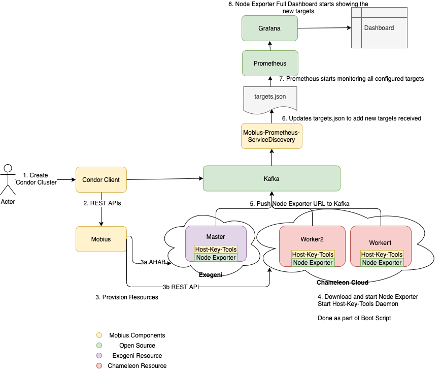
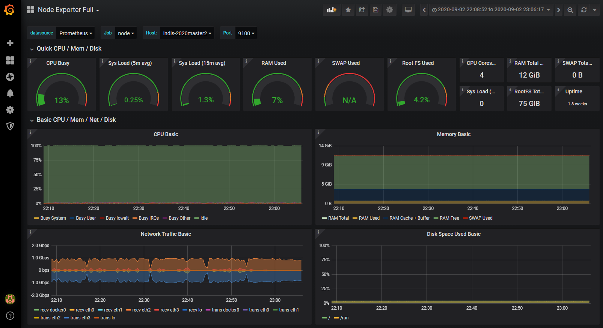
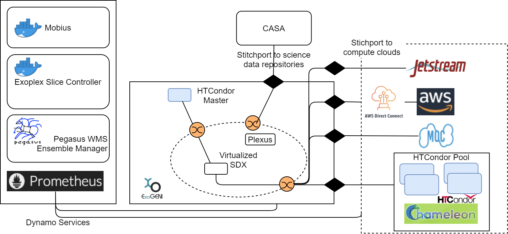
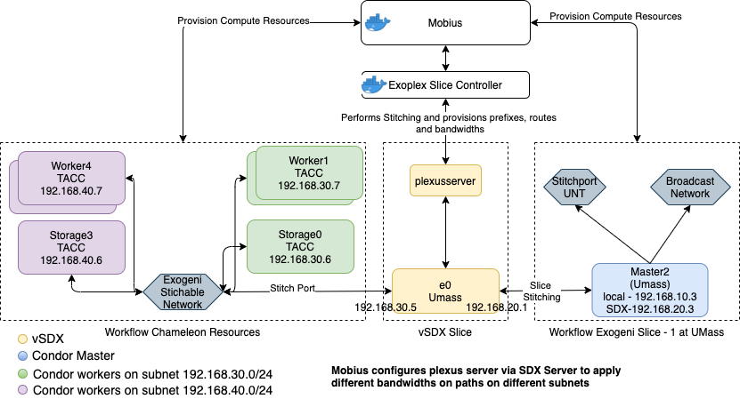
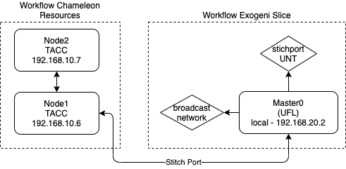

# Table of contents

- [Mobius](#Mobius)
  - [Component Diagram](#component)
  - [Cloud API](#api)
    - [Ahab](#ahab)
    - [Apache Jclouds](#jclouds)
  - [Workflow Database](#db)
  - [Periodic Processor](#pp)
  - [Policy Monitor](#pm)
  - [Mobius Controller](#mc)
  - [Mobius APIs](#todo)
  - [How to use or launch Mobius?](#docker)
# <a name="Mobius"></a>DyNamo Network-centric Platform: Mobius
A network-centric platform called Mobius depicted in Figure includes (a) support for integrated, multi-cloud resource provisioning and for high-performance science data flows across diverse infrastructures, and (b) enhanced mechanisms for interacting with higher level application and workflow management systems and transforming high-level resource requests to low-level provisioning actions, thereby bridging the abstraction gap between data-driven science applications and resource provisioning systems, and (c) transparently maintain the quality of service of the provisioned end-to-end infrastructure through continuous monitoring and control. Mobius was enhanced to support the provisioning of network connections between compute resources across sites/clouds and modulating the bandwidth on these network connections.

The  Mobius  platform  has  been  implemented  as  a  Springframework  based  REST  server  and  exposes  a  REST  API  forautomated provisioning of network and compute resources. Itconsumes high level application-aware resource requests fromscientists or from workflow systems managing the applicationson  behalf  of  scientists  and  automatically  provisions  computeresources and network paths using the native APIs of differentresource  providers.  The  structure  of  the  different  high-levelprovisioning  requests  for  compute,  storage  and  network  re-sources are documented in the Mobius github repository [Design](./mobius/Readme.md). Essentially, the applications can specify to Mobius their resourcerequirements over time in the form of a Gantt chart. Scientists can easily set up application-specific environments by invokingthe Mobius REST API. 


- Design details can be found in [Design](./mobius/Readme.md)
- Interface specifications can be found in [Interface](./mobius/Interface.md)
- Code can be generated via swagger by referring to [HowToGenerateCodeFromSwagger](./mobius/HowToGenerateCodeFromSwagger.md)
## <a name="component"></a>Component Diagram


## <a name="api"></a> Multi-cloud and Network Resource Manager
At this layer, Mobius translates application requests to native cloud specific requests. Since we are leveraging the ExoGENI network overlay to set up data flow paths, the application-level data movement requests get translated to ExoGENI network provisioning requests. The Multi-cloud and Network Resource Manager consists of two native cloud specific adapters to provision resources on our target infrastructures.

### <a name="ahab"></a> AHAB 
is a collection of graph-based Java libraries designed to allow applications to control, modify and manage the state of ExoGENI slices. The native request and resource representation used by ExoGENI is based on declarative representations using NDL-OWL. Ahab includes libndl, which provides a graph-based abstraction for interacting with ExoGENI slices. It primary handles the conversion of an abstract topology graph consisting of ComputeNodes, networks, stitchports, storage, etc. into NDL-OWL resource requests, which are then sent to ExoGENI using another library called libtransport. The Mobius Ahab adapter leverages the Ahab library functionalities to instantiate compute resources on ExoGENI racks and to create network paths between stitchports, ExoGENI racks and other cloud providers like ChameleonCloud. 

## <a name="jclouds"></a> Apache Jclouds
Apache jclouds is an open source multi-cloud toolkit for the Java platform that allows to create applications that are portable across different cloud providers while maintaining full control to use cloud-specific features. We have implemented a Mobius jclouds adapter for OpenStack to provision resources on Chameleon Cloud, XSEDE JetStream, Amazon AWS and Mass Open Cloud. We also plan to add support for AWS DirectConnect to move data in and out of the EC2 provisioned resources.

## <a name="db"></a> Workflow Database
The information about all the resources provisioned for a workflow or an application on different clouds and the corresponding application request parameters is maintained in the  Workflow Database (PostgreSql hosted on a docker container).

## <a name="pp"></a> Periodic Processor
The high level application requests can be represented as a Gantt chart of required resources for a particular application or workflow. The periodic processor triggers the provisioning of the resources scheduled to be provisioned at a particular time. It also monitors the provisioning status of all the resources instantiated for various application workflows and triggers notifications to applications/workflow management system via an AMQP based messaging space.

## <a name="pm"></a> Monitoring and Control
The Prometheus monitoring system has been added to the DyNamo ecosystem. Mobius automatically configures the Prometheus node exporter on each compute node to push system metrics to a Prometheus server hosted at RENCI. The metrics collected by Prometheus enable us to dynamically take actions to ensure the infrastructure QoS. The actions include enabling compute, storage and network elasticity, i.e., growing and shrinking compute or storage resource pools and increasing or decreasing network properties of links. To visualize the collected data in a comprehensive and easy to understand way, an instance of Grafana has been configured to pull the metric data from Prometheus and plot various graphs on a dashboard depicted in Figure.



### Example Monitoring Dashboard


## <a name="pm"></a> Virtual SDX
A Virtual Software Defined Exchange (vSDX) is defined as a virtual interconnect point between multiple adjacent domains, e.g, instruments, compute resources, or data/storage systems. Like a static SDX, a vSDX uses Software Define Networking (SDN) within the exchange to enforce different network policies.

In our case, the vSDX support is provided by the ExoPlex network architecture depicted in Figure below. ExoPlex uses an elastic slice controller to coordinate dynamic circuits and the Bro security monitors via Ahab. The controller exposes REST APIs for clients to request network stitching and connectivity and to express QoS parameters. The vSDX slice is comprised by virtual compute nodes running OpenVSwitch, OpenFlow controllers, and Bro traffic monitors. Traffic flow and routing within the vSDX slice are governed of a variant of the Ryu rest router SDN controller. The vSDX slice controller computes routes internally for traffic transiting through the vSDX network, and invokes the northbound SDN controller API to install them. The SDN controller runs another Ryu module (rest ofctl) to block traffic from offending senders. If a Bro node detects that traffic violates a Bro policy, it blocks the sender’s traffic by invoking a rest ofctl API via the Bro NetControl plugin.

In our scenario, the Exoplex Slice controller runs as a docker container. Mobius has been enhanced to communicate with the ExoPlex Slice controller to establish network connectivity between ExoGENI and Chameleon via layer2 networks and to allocate bandwidth to individual workflows. Once connectivity is established, Mobius triggers REST API calls to publish network prefixes, sets up routes between network prefixes and dynamically applies different bandwidths as needed. Additionally, we have implemented a Python based interface that can be used to provision the required resources. This interface enables programmatic resource provisioning and is capable of spinning up resources, establishing connectivity and implementing network QoS policies on a per workflow ensemble level.


### Exoplex vSDX


### Cross Test Bed Resources with Virtual SDX Example and Qos Rules applied


### Cross Test Bed Resources without Virtual SDX Example


## <a name="mc"></a> Mobius Controller
The Mobius controller orchestrates all the above components and processes the incoming REST requests to trigger appropriate Mobius components. 

## <a name="todo"></a>APIS
API Documentation can be found [here](https://app.swaggerhub.com/apis-docs/kthare10/mobius/1.0.0)

#### Version

The Orchestrator API is versioned based on the release found in GitHub.

API :

Resource | Action | Input | Output
:--------|:----:|:---:|:---:
`/listWorkflows` | GET: Get the list of active workflows | NA | Response format
`/workflow` | GET: Get the status of the workflow by passing workflow id | `workflowID` Workflow ID | Response format
`/workflow` | POST: Creates a new workflow | `workflowID` Workflow ID | Response format
`/workflow` | POST: Creates a new workflow | `workflowID` Workflow ID | Response format
`/workflow` | DELETE: Delete a workflow | `workflowID` Workflow ID | Response format
`/storage` | POST: Request/modify storage resource for a workflow | `workflowID` Workflow ID, `storage request` body | Response format
`/network` | POST: Request/modify network resource for a workflow | `workflowID` Workflow ID, `network request` body | Response format
`/compute` | POST: Request/modify compute resource for a workflow | `workflowID` Workflow ID, `compute request` body | Response format
`/stitch` | POST: Request/modify stitching | `workflowID` Workflow ID, `stitch request` body | Response format
`/sdxPrefix` | POST: Request to publish subnets and connect them at the SDX | `workflowID` Workflow ID, `prefix request` body | Response format
`/script` | POST: Request to push command or set of commands to a node | `workflowID` Workflow ID, `script request` body | Response format


Example: Response format

```json
{
  "status": 0,
  "message": "string",
  "value": {},
  "version": "string"
}
```
Storage Request
```json
{
  "mountPoint": "string",
  "target": "string",
  "size": 0,
  "leaseStart": "string",
  "leaseEnd": "string",
  "action": "add"
}
```
Network Request
```json
{
  "source": "string",
  "sourceIP": "string",
  "sourceSubnet": "string",
  "sourceLocalSubnet": "string",
  "destination": "string",
  "destinationIP": "string",
  "destinationSubnet": "string",
  "destLocalSubnet": "string",
  "linkSpeed": "string",
  "leaseStart": "string",
  "leaseEnd": "string",
  "chameleonSdxControllerIP": "string",
  "action": "add"
}
```
Compute Request
```json
{
  "site": "string",
  "cpus": 0,
  "gpus": 0,
  "ramPerCpus": 0,
  "diskPerCpus": 0,
  "leaseStart": "string",
  "leaseEnd": "string",
  "coallocate": false,
  "slicePolicy": "default",
  "sliceName": "string",
  "hostNamePrefix": "string",
  "ipAddress": "string",
  "bandwidth": "string",
  "networkType": "default",
  "physicalNetwork": "string",
  "externalNetwork": "string",
  "networkCidr": "string",
  "vpcCidr": "string",
  "imageUrl": "string",
  "imageHash": "string",
  "imageName": "string",
  "postBootScript": "string",
  "stitchPortUrl": "string",
  "stitchTag": "string",
  "stitchIP": "string",
  "stitchBandwidth": "string",
  "forceflavor": "string",
  "cometFamily": "string"
}
```
Stitch Request
```json
{
  "target": "string",
  "portUrl": "string",
  "tag": "string",
  "stitchIP": "string",
  "bandwidth": "string"
}
```
Prefix Request
```json
{
  "source": "string",
  "sourceSubnet": "string",
  "gatewayIP": "string",
  "destinationSubnet": "string",
  "bandwidth": "string"
}
```
Script Request
```
{
  "target": "string",
  "name": "string",
  "script": "string"
}
```
## <a name="docker"></a>How to use or launch Mobius?
- Refer to [Docker](./docker/Readme.md) to launch Mobius
