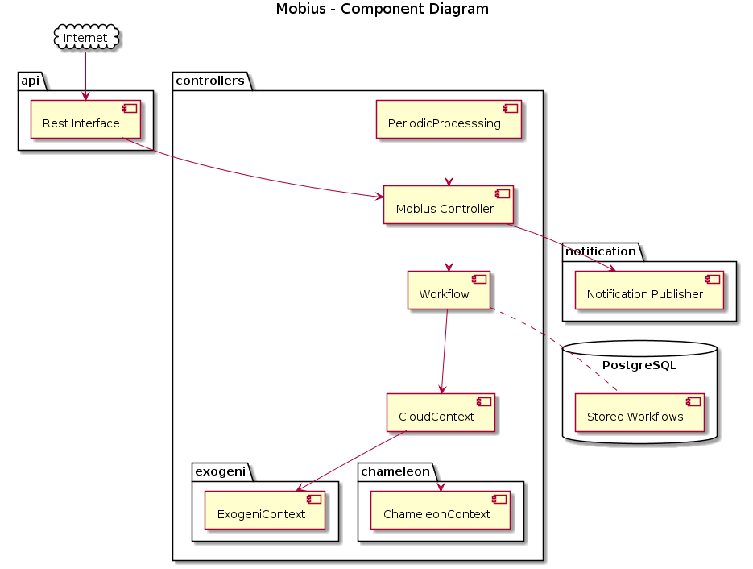

# Table of contents

- [Mobius](#Mobius)
  - [Block Diagram](#block)
    - [Rest Interface](#rest)
    - [Mobius Controller](#controller)
    - [Workflow](#workflow)
    - [CloudContext](#cloudcontext)
      - [ExogeniContext & SliceContext](#context)
    - [Periodic Processing](#periodic)  
    - [Notification Publisher](#notification)
    - [Stored Worflows](#stored)
  - [To do list](#todo)
  - [How to use or launch Mobius?](#docker)
# Mobius

Spring Boot Rest Server which has the capability to provision resources on different cloud infrastructures. In this release, Exogeni, Chameleon and Open Science Grid clouds are supported

- Design details can be found in [Design](./mobius/Readme.md)
- Interface specifications can be found in [Interface](./mobius/Interface.md)
- Code can be generated via swagger by referring to [HowToGenerateCodeFromSwagger](./mobius/HowToGenerateCodeFromSwagger.md)

## Block Diagram

### Rest Interface
It represents Swagger generated REST API interface with Spring framework controllers through which Mobius controller logic is invoked.
### Mobius Controller
Is responsible for creating and maintaining workflows. It maintains a hashmap of workflows with workflowId as the key. User requests for a workflowID via 'POST /mobius/workflow' API which results in generation of workflowId and Workflow object. The pair is added to hashmap. All subsequent operations are performed on this workflow object identitied by workflowId.
### Workflow
Represents Workflow which spans across clouds and maintains hashMap of CloudContext with siteName as key. Any compute request either finds an existing context or creates a new context to satisfy the request. Any storage/networks request finds existing context to process the request.
### CloudContext
Represents slice(s) on a specific site on a specific cloud. ExogeniContext, ChameleonContext represent Exogeni and chameleon specific instances of this class.
#### ExogeniContext & SliceContext
Represents slice(s) on Exogeni on a specific site. It maintains hashMap of SliceContext representing one slice with sliceName as the key. Any compute requests with the same leaseEnd time of any existing context result in a modifySlice. If no existing slice has the same leaseEnd time as in incoming request, a new Slice is created to handle the request and corresponding SliceContext object is added to hashMap. ExogeniContext also maintains futureRequest queue. Any incoming request with leaseStartTime in future is added to futureRequest Queue.
### PeriodicProcessing 
Represents Periodic Processing Thread is responsible for periodically performing below actions:
- Handle future Compute/Storage/Network request from futureRequest Queue
- Check status of workflow and trigger a notification to Pegasus if there is any change in workflow status
### Notification Publisher
Responsible for triggering notfications to Pegasus on Workflow status change. It currently uses AMQP but is easily extendible to use other frameworks like kafka.
### Stored Worflows
Each workflow saves its workflowId and hashMap for CloudContexts in the Database. This information can be used to create Workflow context in case of abnormal restart of Mobius application.

## TODO List
- User / certificate information
  - Possible options
    - Option 1
      - Expose APIs for add/update/delete user
      - Pass user name when starting a new workflow
    - Option 2
      - POST workflow API to take username and credentials, controller url for each cloud type to be used later for that workflow
- Enable Mobius to pass HEAT Templates
- Create network to connect chameleon compute resources instead of using sharednet

## How to use or launch Mobius?
- Refer to [Docker](./docker/Readme.md) to launch Mobius
