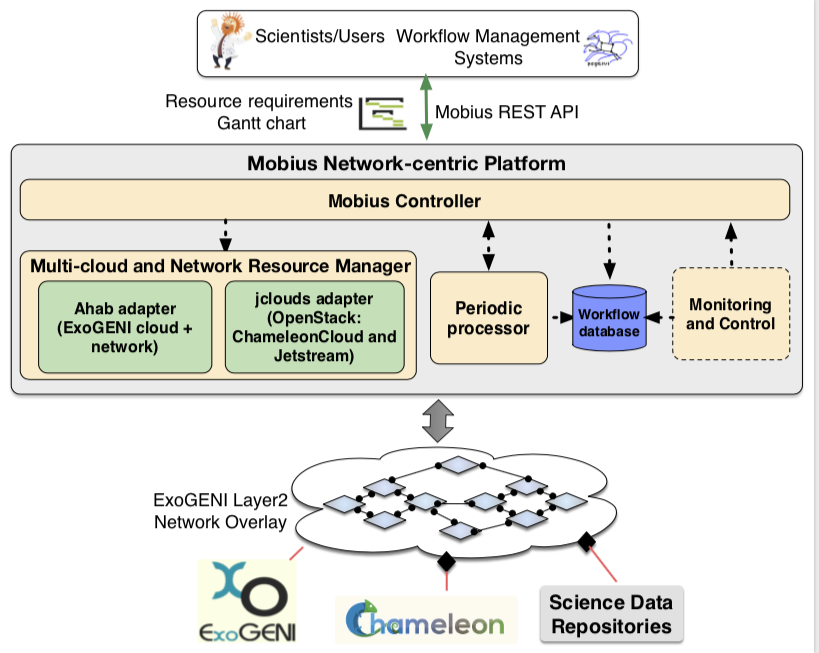

# Table of contents

- [Mobius](#Mobius)
  - [Component Diagram](#component)
  - [Cloud API](#api)
    - [Ahab](#ahab)
    - [Apache Jclouds](#jclouds)
  - [Workflow Database](#db)
  - [Periodic Processor](#pp)
  - [Policy Monitor](#pm)
  - [Mobius Controller](#mc)
  - [To do list](#todo)
  - [How to use or launch Mobius?](#docker)
# DyNamo Network-centric Platform: Mobius
A network-centric platform called Mobius includes (a) support for integrated, multi-cloud resource provisioning and high-performance science data flows across diverse infrastructures, and (b) enhanced mechanisms for interacting with higher level application and workflow management systems and transforming high-level resource requests to low-level provisioning actions, thereby bridging the abstraction gap between data-driven science applications and resource provisioning systems. Another goal for Mobius, not addressed in this work, is to transparently maintain the quality of service of the provisioned end-to-end infrastructure through continuous monitoring and control.

The  Mobius  platform  has  been  implemented  as  a  Springframework  based  REST  server  and  exposes  a  REST  API  forautomated provisioning of network and compute resources. Itconsumes high level application-aware resource requests fromscientists or from workflow systems managing the applicationson  behalf  of  scientists  and  automatically  provisions  computeresources and network paths using the native APIs of differentresource  providers.  The  structure  of  the  different  high-levelprovisioning  requests  for  compute,  storage  and  network  re-sources are documented in the Mobius github repository [Design](./mobius/Readme.md). Es-sentially, the applications can specify to Mobius their resourcerequirements over time in the form of a Gantt chart. Scientists can easily set up application-specific environments by invokingthe Mobius REST API. 

- Design details can be found in [Design](./mobius/Readme.md)
- Interface specifications can be found in [Interface](./mobius/Interface.md)
- Code can be generated via swagger by referring to [HowToGenerateCodeFromSwagger](./mobius/HowToGenerateCodeFromSwagger.md)
## Component Diagram

##  Multi-cloud and Network Resource Manager
At this layer, Mobius translates application requests to native cloud specific requests. Since we are leveraging the ExoGENI network overlay to set up data flow paths, the application-level data movement requests get translated to ExoGENI network provisioning requests. The Multi-cloud and Network Resource Manager consists of two native cloud specific adapters to provision resources on our target infrastructures.

###  AHAB 
is a collection of graph-based Java libraries designed to allow applications to control, modify and manage the state of ExoGENI slices. The native request and resource representation used by ExoGENI is based on declarative representations using NDL-OWL. Ahab includes libndl, which provides a graph-based abstraction for interacting with ExoGENI slices. It primary handles the conversion of an abstract topology graph consisting of ComputeNodes, networks, stitchports, storage, etc. into NDL-OWL resource requests, which are then sent to ExoGENI using another library called libtransport. The Mobius Ahab adapter leverages the Ahab library functionalities to instantiate compute resources on ExoGENI racks and to create network paths between stitchports, ExoGENI racks and other cloud providers like ChameleonCloud. 

##  Apache Jclouds
Apache jclouds is an open source multi-cloud toolkit for the Java platform that allows to create applications that are portable across different cloud providers while maintaining full control to use cloud-specific features. We have implemented a Mobius jclouds adapter for OpenStack to provision resources on ChameleonCloud and XSEDE JetStream. We also plan to implement a Mobius jclouds adapter for Amazon EC2 to provision resources on Amazon AWS, which can then be used in conjunction with the stitchport for AWS DirectConnect to move data in and out of the EC2 provisioned resources.

##  Workflow Database
The information about all the resources provisioned for a workflow or an application on different clouds and the corresponding application request parameters is maintained in the  Workflow Database (PostgreSql hosted on a docker container).

##  Periodic Processor
The high level application requests can be represented as a Gantt chart of required resources for a particular application or workflow. The periodic processor triggers the provisioning of the resources scheduled to be provisioned at a particular time. It also monitors the provisioning status of all the resources instantiated for various application workflows and triggers notifications to applications/workflow management system via an AMQP based messaging space.

##  Monitoring and Control
The Monitoring and Control module is designed to transparently maintain the quality of service of the provisioned end-to-end infrastructure through continuous monitoring and control. Based on policies and thresholds defined, the goal is to identify the appropriate actions to be taken to ensure the infrastructure QoS at all times. The actions include enabling compute, storage and network elasticity i.e. growing and shrinking compute or storage resource pools and increasing or decreasing network properties of links. This module is currently under development. Details can be found [here](./monitoring/Readme.md)

##  Mobius Controller
The Mobius controller orchestrates all the above components and processes the incoming REST requests to trigger appropriate Mobius components. 

## TODO List
- Enable Mobius to pass HEAT Templates
## How to use or launch Mobius?
- Refer to [Docker](./docker/Readme.md) to launch Mobius
