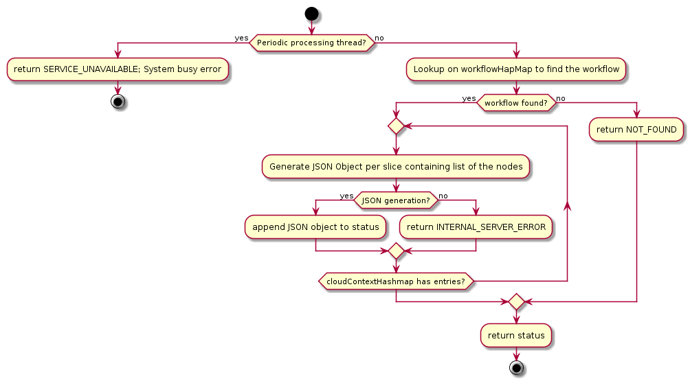
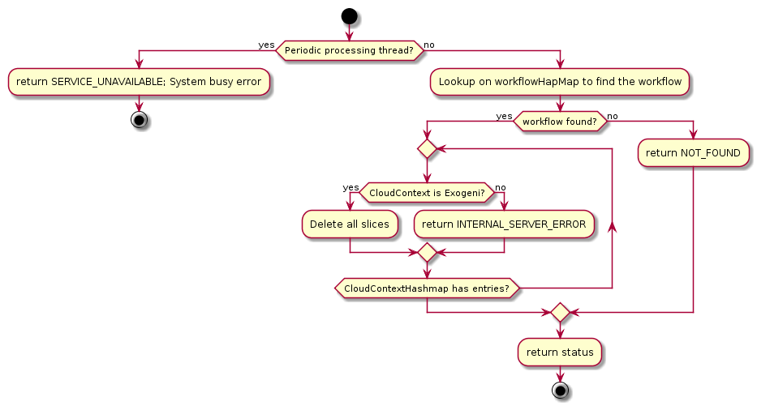
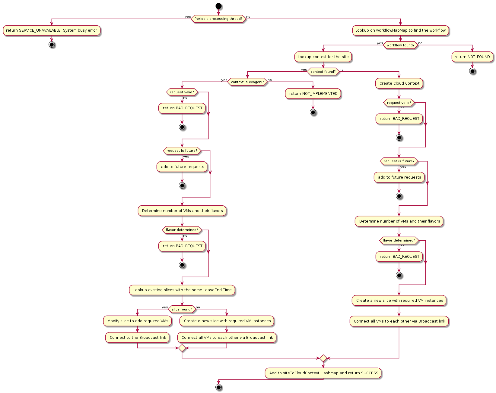

# Design

Mobius is Spring-Boot based REST Webserver with the ability to provision compute, network or storage resources on multiple clouds. In the first release, following 3 cloud providers will be supported:
- Exogeni
- Chameleon
- Open Science Grid

It has 2 main processing components:
- Mobius Controller
- Periodic Processing Thread

## Mobius Controller
Mobius controller is responsible for handling Rest APIs. It is a Singleton class and maintains all the workflows in workflowHashMap with workFlowId as the key.
### Workflow
Workflow is uniquely identified by its ID. Workflow can span across clouds and sites. It maintains a hashtable of CloudContext with siteName as the key. MobiusController handles create, get and delete operations for workflow as explained below. 
#### Create

```
POST -i "<ip/hostname>:8080/mobius/workflow" -H "accept: application/json"
```
#### Get

```
GET -i "<ip/hostname>:8080/mobius/workflow?workflowID=<workflowID>" -H "accept: application/json"

Example Output:
{
"status":200,
"message":"Success",
"value":"{"workflowStatus":"[{\"nodes\":[{\"name\":\"dataNode1\",\"publicIP\":\"152.54.14.14\",\"state\":\"Active\",\"ip1\":\"172.16.0.2\"},
{\"name\":\"dataNode0\",\"publicIP\":\"152.54.14.6\",\"state\":\"Active\",\"ip1\":\"172.16.0.1\"}],
\"slice\":\"Mobius-Exogeni-kthare10-afdc64d6-290f-4f35-bbad-169d848cce1f\"},
{\"nodes\":[{\"name\":\"dataNode3\",\"publicIP\":\"152.54.14.18\",\"state\":\"Active\",\"ip1\":\"172.16.0.1\"}],
\"slice\":\"Mobius-Exogeni-kthare10-5c4f6855-9333-4a46-905f-e82d414f0575\"}]"}",
"version":"0.1"
}
```
#### DELETE

```
DELETE -i "<ip/hostname>:8080/mobius/workflow?workflowID=<workflowID>" -H "accept: application/json"
```
#### COMPUTE

```
POST "<ip/hostname>:8080/mobius/compute?workflowID=<workflowId>" -H "accept: application/json" -H "Content-Type: application/json" -d @compute.json 

$ cat compute.json
{
    "site":"Exogeni:RENCI (Chapel Hill, NC USA) XO Rack",
    "cpus":"1",
    "gpus":"0",
    "ramPerCpus":"1",
    "diskPerCpus":"11",
    "leaseStart":"1545151122",
    "leaseEnd":"1545551122"
}
```
NOTE: For Exogeni, slice names are generated as 'Mobius-Exogeni-<user>-uuid'. Hostnames for VMs are dataNode<Number>
#### STORAGE

```
POST "<ip/hostname>:8080/mobius/compute?workflowID=<workflowId>" -H "accept: application/json" -H "Content-Type: application/json" -d @storage.json 
$ cat storage.json
{
    "mountPoint":"/mnt/",
    "target":"dataNode0",
    "size":"1",
    "leaseStart":"1545151122",
    "leaseEnd":"1545551122",
    "action":"add"
}
```
## Periodic Processing Thread
This thread runs every 60 seconds and performs following actions:
  - For each workflow, checks status of all the contexts(slices)
    - If status of all VMs has changed from Ticketed to Active; sends notification to Pegasus of the workflow status
```
Sending notification to Pegasus = [{"nodes":[{"name":"dataNode1","publicIP":"152.54.14.14","state":"Active","ip1":"172.16.0.2"},
 {"name":"dataNode0","publicIP":"152.54.14.6","state":"Active","ip1":"172.16.0.1"}],
  "slice":"Mobius-Exogeni-kthare10-afdc64d6-290f-4f35-bbad-169d848cce1f"},
{"nodes":[{"name":"dataNode3","publicIP":"152.54.14.18","state":"Active","ip1":"172.16.0.1"}],
  "slice":"Mobius-Exogeni-kthare10-5c4f6855-9333-4a46-905f-e82d414f0575"}]
```
