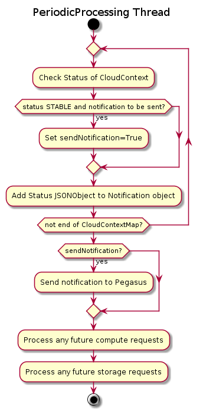
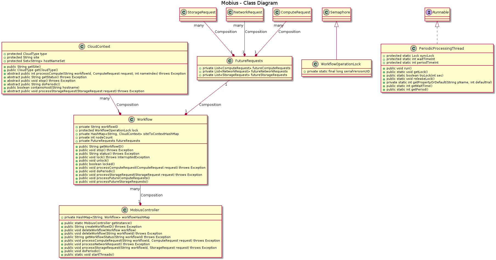
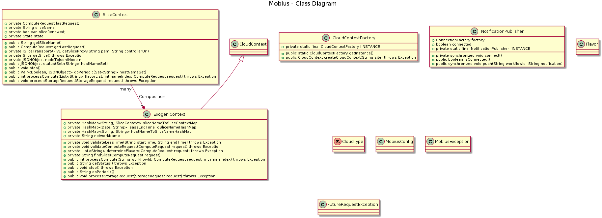

# Table of contents
 - [Mobius](#mobius)
 - [Mobius Controller](#controller)
   - [Workflow](#workflow)
     - [Create Workflow](#create)
     - [Get Workflow](#get)
     - [Delete workflow](#delete)
   - [Compute](#compute)
   - [Storage](#storage)
 - [Periodic Processing](#periodic)
 - [Class Diagram](#classdiagram)
 
# <a name="mobius"></a>Mobius

Mobius is Spring-Boot based REST Webserver with the ability to provision compute, network or storage resources on multiple clouds. In the first release, following 3 cloud providers will be supported:
- Exogeni
- Chameleon
- Open Science Grid

It has 2 main processing components:
- Mobius Controller
- Periodic Processing Thread

## <a name="controller"></a>Mobius Controller
Mobius controller is responsible for handling Rest APIs. It is a Singleton class and maintains all the workflows in workflowHashMap with workFlowId as the key.
### <a name="workflow"></a>Workflow
Workflow is uniquely identified by its ID. Workflow can span across clouds and sites. It maintains a hashtable of CloudContext with siteName as the key. MobiusController handles create, get and delete operations for workflow as explained below. 
#### <a name="create"></a>Create

```
POST -i "<ip/hostname>:8080/mobius/workflow" -H "accept: application/json"
```
#### <a name="get"></a>Get

```
GET -i "<ip/hostname>:8080/mobius/workflow?workflowID=<workflowID>" -H "accept: application/json"

Example Output:
{
"status":200,
"message":"Success",
"value":"{"workflowStatus":"[{\"nodes\":[{\"name\":\"dataNode1\",\"publicIP\":\"152.54.14.14\",\"state\":\"Active\",\"ip1\":\"172.16.0.2\"},
{\"name\":\"dataNode0\",\"publicIP\":\"152.54.14.6\",\"state\":\"Active\",\"ip1\":\"172.16.0.1\"}],
\"slice\":\"Mobius-Exogeni-kthare10-afdc64d6-290f-4f35-bbad-169d848cce1f\"},
{\"nodes\":[{\"name\":\"dataNode3\",\"publicIP\":\"152.54.14.18\",\"state\":\"Active\",\"ip1\":\"172.16.0.1\"}],
\"slice\":\"Mobius-Exogeni-kthare10-5c4f6855-9333-4a46-905f-e82d414f0575\"}]"}",
"version":"0.1"
}
```
#### <a name="delete"></a>Delete

```
DELETE -i "<ip/hostname>:8080/mobius/workflow?workflowID=<workflowID>" -H "accept: application/json"
```
#### <a name="compute"></a>Compute

```
POST "<ip/hostname>:8080/mobius/compute?workflowID=<workflowId>" -H "accept: application/json" -H "Content-Type: application/json" -d @compute.json 

$ cat compute.json
{
    "site":"Exogeni:RENCI (Chapel Hill, NC USA) XO Rack",
    "cpus":"1",
    "gpus":"0",
    "ramPerCpus":"1",
    "diskPerCpus":"11",
    "leaseStart":"1545151122",
    "leaseEnd":"1545551122"
}
```
NOTE: For Exogeni, slice names are generated as 'Mobius-Exogeni-<user>-uuid'. Hostnames for VMs are dataNode<Number>
#### <a name="storage"></a>Storage

```
POST "<ip/hostname>:8080/mobius/compute?workflowID=<workflowId>" -H "accept: application/json" -H "Content-Type: application/json" -d @storage.json 
$ cat storage.json
{
    "mountPoint":"/mnt/",
    "target":"dataNode0",
    "size":"1",
    "leaseStart":"1545151122",
    "leaseEnd":"1545551122",
    "action":"add"
}
```
## <a name="periodic"></a>Periodic Processing Thread

```
Sending notification to Pegasus = 
[
    {
        "slices":
            [
                {
                    "nodes":
                        [
                            {
                                "name":"dataNode1storage",
                                "state":"Active"
                            },
                            {
                                "name":"dataNode7",
                                "publicIP":"152.54.14.30",
                                "state":"Active",
                                "ip1":"172.16.0.2"
                            },
                            {
                                "name":"dataNode1",
                                "publicIP":"152.54.14.28",
                                "ip2":"172.16.0.1",
                                "state":"Active",
                                "ip1":"10.104.0.6"
                            }
                        ],
                    "slice":"Mobius-Exogeni-kthare10-644c2ec3-784a-4f1d-8878-2862670f8c8c"
                }
            ],
        "site":"Exogeni:RENCI (Chapel Hill, NC USA) XO Rack"
    },
    {
        "slices":
            [
                {
                    "nodes":
                        [
                            {
                                "name":"dataNode0",
                                "publicIP":"162.244.229.107",
                                "state":"Active","ip1":"172.16.0.1"
                            },
                            {
                                "name":"dataNode3",
                                "publicIP":"162.244.229.108",
                                "state":"Active",
                                "ip1":"172.16.0.1"
                            }
                        ],
                    "slice":"Mobius-Exogeni-kthare10-e5ee3668-428e-4899-a4dd-f83f16f4f7d5"
                }
            ],
        "site":"Exogeni:CIENA2 (Hanover, MD) XO Rack"
    }
]
```
## <a name="classdiagram"></a>Class Diagram


