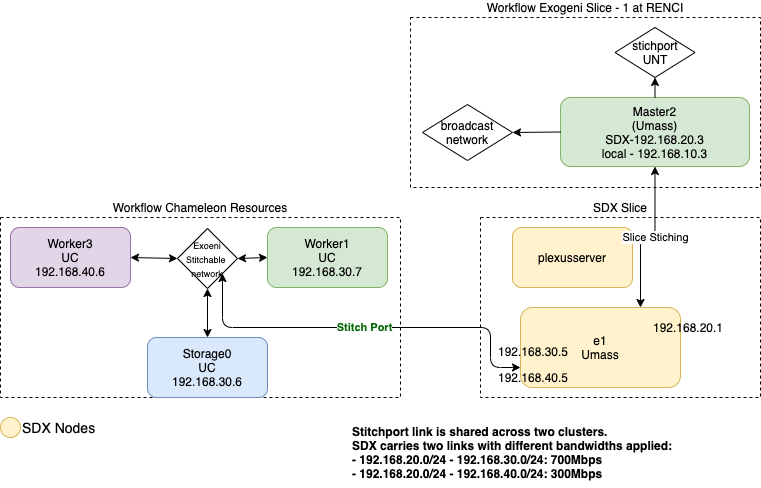

# Table of contents

 - [Description](#descr)
 - [Installation](#install)
   - [Mobius Client](#mbclient)
     - [Usage](#usage1)
   - [K8s Client](#k8sclient)
     - [Usage](#k8susage)
     - [Examples](#k8sexamples)
   - [Condor Client](#condorclient)
     - [Usage](#usage2)   
   - [Json Data](#json)
   - [Certificates](#certs)
   - [Mobius Client Examples](#mobius_client_examples)
     - [Create a workflow](#createworkflow)
     - [Create a compute node in a workflow](#createcompute)
     - [Create a stitch port in a workflow](#createstitchport)
     - [Get status of a workflow](#getworkflow)
     - [Delete a workflow](#deleteworkflow)
     - [List workflows](#listworkflow)
   - [Condor Client Examples](#condor_client_examples)
     - [Create a condor cluster](#create)
     - [Get status of condor cluster](#get)
     - [Delete condor cluster](#delete)
     - [List workflows](#list)
 
# <a name="descr"></a>Description
The Mobius API is a Python library that simplifies the native cloud interfaces for various clouds such as FABRIC, 
Chameleon and adds many additional capabilities that are commonly used to create experiments.

The easiest way to get started using Mobius API is to use the example shown below.

```
    # Create a controller obect
    # Default slice name is picked up from the config file
    controller = Controller(config_file_location="./config.yml")
    # User specified slice name is used to identify the resources
    #controller = Controller(config_file_location="./config.yml", slice_name="test-slice")
    # Provision the resources as specified in the configuration file
    controller.create()
    # Get the provisioned resources
    resources = controller.get_resources()
    # Print the resources provisioned
    for r in resources:
        print(r)
        print(r.list_nodes())
```

User is expected to provide a config file `config.yml` containing their credentials and resource parameters. Template
`mobius/config/config_template.yml` can be used to create a `config.yml`. Please find below the list of the parameters 
that must be updated.

- Update the SSH public and private key files to be used for the provisioned VMs/Bare Metals
```
runtime:
  slice-private-key-location: /Users/kthare10/.ssh/id_rsa
  slice-public-key-location: /Users/kthare10/.ssh/id_rsa.pub
```
- Update FABRIC credentials
  - Location of the user's FABRIC tokens
  - User's Bastion User name
  - User's Fabric Bastion Private Key
  - User's Project Id
```
fabric:
  token-location: /Users/kthare10/renci/code/fabric/notebooks/tokens.json
  bastion-user-name: kthare10_0011904101
  bastion-key-location: /Users/kthare10/.ssh/fabric-bastion
  project_id: b9847fa1-13ef-49f9-9e07-ae6ad06cda3f
```

- Update Chameleon credentials
  - UserName
  - Password
  - Key Pair
  - Project Name
  - Project Id
```
chameleon:
  user: kthare10
  password: 
  key_pair: kthare10
  project_name: CH-822154
  project_id:
    tacc: a400724e818d40cbba1a5c6b5e714462
    uc: ae76673270164b048b59d3bd30676721
    kvm: a400724e818d40cbba1a5c6b5e714462
    edge:
```
- Update the resource counts
  - Set count to 0 or more depending on where the resources should be provisioned.
  - Copy and add more resource blocks if resources are needed at additional sites
  - Change other parameters as needed
```
resources:
    - resource:
        type: VM
        site: RENC # use FABRIC.RANDOM to choose a random site instead
        count: 1
        image: default_rocky_8
        nic_model: NIC_Basic # NIC_Basic(SRIOV), NIC_ConnectX_5 => 25GB, NIC_ConnectX_6 => 100GB
        name_prefix: node
        network:
          type: IPv6 # Allowed values IPv4 or IPv6
        flavor:
          cores: 2
          ram: 8
          disk: 10

    - resource:
        type: Baremetal
        site: KVM@TACC
        count: 1
        image: CC-CentOS8
        network:
          type: sharednet1
        name_prefix: node
        flavor:
          name: m1.large
```

# <a name="install"></a>Installation
You can install using the following command
```
pip install mobius-py
```

## Requirements:
Requires python 3.9 or above version

# CLI
Mobius Python API also provides following CLI interface as well.
- Mobius Client
- Condor Client
- K8s Client

Details about the CLI interface can be found below.

## <a name="mbclient"></a>Mobius Client
Mobius client to trigger Moobius REST commands.

### <a name="usage1"></a>Usage
```
usage: mobius_client.py [-h] [-s SITE] [-m MOBIUSHOST] -o OPERATION -w
                        WORKFLOWID [-d DATA] [-r RESOURCETYPE] [-t TARGET]

Python client to provision cloud resources by invoking Mobius REST Commands.

optional arguments:
  -h, --help            show this help message and exit
  -s SITE, --site SITE  Site
  -m MOBIUSHOST, --mobiushost MOBIUSHOST
                        Mobius Host e.g. http://localhost:8080/mobius
  -o OPERATION, --operation OPERATION
                        Operation allowed values: post|get|delete; post -
                        provision workflow or compute or storage or
                        stitchport; get - get a workflow; delete - delete a
                        workflow
  -w WORKFLOWID, --workflowId WORKFLOWID
                        workflowId
  -d DATA, --data DATA  data, JSON data to send; if not specified; default
                        data is used; only used with post; must not be
                        specified if target is indicated; must be specified
                        for stitchport
  -r RESOURCETYPE, --resourcetype RESOURCETYPE
                        resourcetype allowed values:
                        workflow|compute|storage|stitchport; only used with
                        post; must be specified
  -t TARGET, --target TARGET
                        target hostname of the server to which to attach
                        storage; only used with resourcetype storage
```
## <a name="k8sclient"></a>K8s Client
Python client to provision K8s and Kube Edge Cluster by invoking various Mobius REST APIs on different clouds.

### <a name="k8susage"></a>Usage
```
usage: k8s_client.py [-h] [-s1 EXOGENISITE] [-s2 CHAMELEONSITE]
                     [-s3 JETSTREAMSITE] [-s4 MOCSITE] [-n1 EXOWORKERS]
                     [-n2 CHWORKERS] [-n3 JTWORKERS] [-n4 MOCWORKERS]
                     [-c COMETHOST] [-t CERT] [-k KEY] [-m MOBIUSHOST] -o
                     OPERATION [-w WORKFLOWID] [-i1 EXOIPSTART]
                     [-i2 CHIPSTART] [-i3 JTIPSTART] [-i4 MOCIPSTART]
                     [-l LEASEEND] [-d1 EXODATADIR] [-d2 CHDATADIR]
                     [-d3 JTDATADIR] [-d4 MOCDATADIR] [-kh KAFKAHOST]

Python client to create Condor cluster using mobius. Uses master.json,
submit.json and worker.json for compute requests present in data directory
specified. Currently only supports provisioning compute resources. Other
resources can be provisioned via mobius_client. Creates COMET contexts for
Chameleon resources and thus enables exchanging keys and hostnames within
workflow

optional arguments:
  -h, --help            show this help message and exit
  -s1 EXOGENISITE, --exogenisite EXOGENISITE
                        Exogeni Site at which resources must be provisioned;
                        must be specified for create operation
  -s2 CHAMELEONSITE, --chameleonsite CHAMELEONSITE
                        Chameleon Site at which resources must be provisioned;
                        must be specified for create operation
  -s3 JETSTREAMSITE, --jetstreamsite JETSTREAMSITE
                        Jetstream Site at which resources must be provisioned;
                        must be specified for create operation
  -s4 MOCSITE, --mocsite MOCSITE
                        Mass Open Cloud Site at which resources must be
                        provisioned; must be specified for create operation
  -n1 EXOWORKERS, --exoworkers EXOWORKERS
                        Number of workers to be provisioned on Exogeni; must
                        be specified for create operation
  -n2 CHWORKERS, --chworkers CHWORKERS
                        Number of workers to be provisioned on Chameleon; must
                        be specified for create operation
  -n3 JTWORKERS, --jtworkers JTWORKERS
                        Number of workers to be provisioned on Jetstream; must
                        be specified for create operation
  -n4 MOCWORKERS, --mocworkers MOCWORKERS
                        Number of workers to be provisioned on Mass Open
                        Cloud; must be specified for create operation
  -c COMETHOST, --comethost COMETHOST
                        Comet Host default(https://comet-
                        hn1.exogeni.net:8111/) used only for provisioning
                        resources on chameleon
  -t CERT, --cert CERT  Comet Certificate default(certs/client.pem); used only
                        for provisioning resources on chameleon
  -k KEY, --key KEY     Comet Certificate key default(certs/client.key); used
                        only for provisioning resources on chameleon
  -m MOBIUSHOST, --mobiushost MOBIUSHOST
                        Mobius Host e.g. http://localhost:8080/mobius
  -o OPERATION, --operation OPERATION
                        Operation allowed values: create|get|delete|list|add
  -w WORKFLOWID, --workflowId WORKFLOWID
                        workflowId
  -i1 EXOIPSTART, --exoipStart EXOIPSTART
                        Exogeni Start IP Address of the range of IPs to be
                        used for VMs; 1st IP is assigned to master and
                        subsequent IPs are assigned to submit node and
                        workers; can be specified for create operation
  -i2 CHIPSTART, --chipStart CHIPSTART
                        Chameleon Start IP Address of the range of IPs to be
                        used for VMs; 1st IP is assigned to master and
                        subsequent IPs are assigned to submit node and
                        workers; can be specified for create operation
  -i3 JTIPSTART, --jtipStart JTIPSTART
                        Jetstream Start IP Address of the range of IPs to be
                        used for VMs; 1st IP is assigned to master and
                        subsequent IPs are assigned to submit node and
                        workers; can be specified for create operation
  -i4 MOCIPSTART, --mocipStart MOCIPSTART
                        Mass Open Cloud Start IP Address of the range of IPs
                        to be used for VMs; 1st IP is assigned to master and
                        subsequent IPs are assigned to submit node and
                        workers; can be specified for create operation
  -l LEASEEND, --leaseEnd LEASEEND
                        Lease End Time; can be specified for create operation
  -d1 EXODATADIR, --exodatadir EXODATADIR
                        Exogeni Data directory where to look for master.json,
                        submit.json and worker.json; must be specified for
                        create operation
  -d2 CHDATADIR, --chdatadir CHDATADIR
                        Chameleon Data directory where to look for
                        master.json, submit.json and worker.json; must be
                        specified for create operation
  -d3 JTDATADIR, --jtdatadir JTDATADIR
                        Jetstream Data directory where to look for
                        master.json, submit.json and worker.json; must be
                        specified for create operation
  -d4 MOCDATADIR, --mocdatadir MOCDATADIR
                        Mass Open Cloud Data directory where to look for
                        master.json, submit.json and worker.json; must be
                        specified for create operation
  -kh KAFKAHOST, --kafkahost KAFKAHOST
                        Kafka Host - monitoring server; must be specified for
                        delete operation
```
### <a name="k8sexamples"></a>K8s Example
#### Provision K8s cluster on Exogeni
User can provision Kubernetes and Kube Edge cluster on Exogeni as below:
```
python3 k8s_client.py -s1 'Exogeni:UFL (Gainesville, FL USA) XO Rack'  -d1 ./flynet/exogeni/ -l `date -v +2d +%s` -o create -w flynet2 -n1 2 -i1 192.168.125.10
```

#### Provision K8s cluster on Chameleon
NOTE: Additional Configuration is required in docker/application.properties file for Chameleon KVM. Please check README in docker directory.
##### User can provision Kubernetes and Kube Edge cluster on Chameleon KVM as below:
```
python3 k8s_client.py -s2 'Chameleon:KVM@TACC'  -d2 ./flynet/chameleon/ -l `date -v +2d +%s` -o create -w flynet-chameleon -n2 2 -i2 192.168.125.10
```
#### Provision Hybrid K8s Cluster
- Provision Kubernetes and Kube Edge cluster on Chameleon Baremetal
- Provision Drone and BaseStation on Exogeni
```
python3 k8s_client.py -s2 'Chameleon:CHI@UC'  -d2 ./flynet/chameleon-exo/ -s1 'Exogeni:UFL (Gainesville, FL USA) XO Rack'  -d1 ./flynet/exogeni-drone/  -l `date -v +2d +%s` -o create -w flynet-hybrid -n2 1 -i2 192.168.135.10 -n1 0 -i1 192.168.130.10
```

## <a name="condor"></a>Condor Client
Python client to create Condor clusters by invoking various supported Mobius REST commands.

### <a name="usage2"></a>Usage
```
usage: condor_client.py [-h] [-s1 EXOGENISITE] [-s2 CHAMELEONSITE]
                        [-s3 JETSTREAMSITE] [-s4 MOSSITE] [-n1 EXOWORKERS]
                        [-n2 CHWORKERS] [-n3 JTWORKERS] [-n4 MOSWORKERS]
                        [-c COMETHOST] [-t CERT] [-k KEY] [-m MOBIUSHOST] -o
                        OPERATION -w WORKFLOWID [-i1 EXOIPSTART]
                        [-i2 CHIPSTART] [-i3 JTIPSTART] [-i4 MOSIPSTART]
                        [-l LEASEEND] [-d1 EXODATADIR] [-d2 CHDATADIR]
                        [-d3 JTDATADIR] [-d4 MOSDATADIR] [-kh KAFKAHOST]

Python client to create Condor cluster using mobius. Uses master.json,
submit.json and worker.json for compute requests present in data directory
specified. Currently only supports provisioning compute resources. Other
resources can be provisioned via mobius_client. Creates COMET contexts for
Chameleon resources and thus enables exchanging keys and hostnames within
workflow

optional arguments:
  -h, --help            show this help message and exit
  -s1 EXOGENISITE, --exogenisite EXOGENISITE
                        Exogeni Site at which resources must be provisioned;
                        must be specified for create operation
  -s2 CHAMELEONSITE, --chameleonsite CHAMELEONSITE
                        Chameleon Site at which resources must be provisioned;
                        must be specified for create operation
  -s3 JETSTREAMSITE, --jetstreamsite JETSTREAMSITE
                        Jetstream Site at which resources must be provisioned;
                        must be specified for create operation
  -s4 MOSSITE, --mossite MOSSITE
                        Mass Open Cloud Site at which resources must be
                        provisioned; must be specified for create operation
  -n1 EXOWORKERS, --exoworkers EXOWORKERS
                        Number of workers to be provisioned on Exogeni; must
                        be specified for create operation
  -n2 CHWORKERS, --chworkers CHWORKERS
                        Number of workers to be provisioned on Chameleon; must
                        be specified for create operation
  -n3 JTWORKERS, --jtworkers JTWORKERS
                        Number of workers to be provisioned on Jetstream; must
                        be specified for create operation
  -n4 MOSWORKERS, --mosworkers MOSWORKERS
                        Number of workers to be provisioned on Mass Open
                        Cloud; must be specified for create operation
  -c COMETHOST, --comethost COMETHOST
                        Comet Host default(https://comet-
                        hn1.exogeni.net:8111/) used only for provisioning
                        resources on chameleon
  -t CERT, --cert CERT  Comet Certificate default(certs/inno-
                        hn_exogeni_net.pem); used only for provisioning
                        resources on chameleon
  -k KEY, --key KEY     Comet Certificate key default(certs/inno-
                        hn_exogeni_net.key); used only for provisioning
                        resources on chameleon
  -m MOBIUSHOST, --mobiushost MOBIUSHOST
                        Mobius Host e.g. http://localhost:8080/mobius
  -o OPERATION, --operation OPERATION
                        Operation allowed values: create|get|delete
  -w WORKFLOWID, --workflowId WORKFLOWID
                        workflowId
  -i1 EXOIPSTART, --exoipStart EXOIPSTART
                        Exogeni Start IP Address of the range of IPs to be
                        used for VMs; 1st IP is assigned to master and
                        subsequent IPs are assigned to submit node and
                        workers; can be specified for create operation
  -i2 CHIPSTART, --chipStart CHIPSTART
                        Chameleon Start IP Address of the range of IPs to be
                        used for VMs; 1st IP is assigned to master and
                        subsequent IPs are assigned to submit node and
                        workers; can be specified for create operation
  -i3 JTIPSTART, --jtipStart JTIPSTART
                        Jetstream Start IP Address of the range of IPs to be
                        used for VMs; 1st IP is assigned to master and
                        subsequent IPs are assigned to submit node and
                        workers; can be specified for create operation
  -i4 MOSIPSTART, --mosipStart MOSIPSTART
                        Mass Open Cloud Start IP Address of the range of IPs
                        to be used for VMs; 1st IP is assigned to master and
                        subsequent IPs are assigned to submit node and
                        workers; can be specified for create operation
  -l LEASEEND, --leaseEnd LEASEEND
                        Lease End Time; can be specified for create operation
  -d1 EXODATADIR, --exodatadir EXODATADIR
                        Exogeni Data directory where to look for master.json,
                        submit.json and worker.json; must be specified for
                        create operation
  -d2 CHDATADIR, --chdatadir CHDATADIR
                        Chameleon Data directory where to look for
                        master.json, submit.json and worker.json; must be
                        specified for create operation
  -d3 JTDATADIR, --jtdatadir JTDATADIR
                        Jetstream Data directory where to look for
                        master.json, submit.json and worker.json; must be
                        specified for create operation
  -d4 MOSDATADIR, --mosdatadir MOSDATADIR
                        Mass Open Cloud Data directory where to look for
                        master.json, submit.json and worker.json; must be
                        specified for create operation
  -kh KAFKAHOST, --kafkahost KAFKAHOST
                        Kafka Host - monitoring server; must be specified for
                        delete operation    
```
### <a name="json"></a>JSON Data
Json Data for Master, Submit and Worker Nodes is read from Mobius/python/data directory.

### <a name="certs"></a>Certificates
Example Comet Certficates are present in Mobius/python/certs directory.

### <a name="mobius_client_examples"></a>Mobius Client Examples
#### <a name="createworkflow"></a>Create a workflow
```
python3 mobius_client.py -o post -r workflow -w abcd-1234
```
#### <a name="createcompute"></a>Create a compute node in a workflow
The following example also shows IP address assignment controlled by user.
```
python3 mobius_client.py -o post -r compute -w abcd-1234 -d '{
    "site":"Exogeni:UH (Houston, TX USA) XO Rack",
    "cpus":"4",
    "gpus":"0",
    "ramPerCpus":"3072",
    "diskPerCpus":"19200",
    "hostNamePrefix":"master",
    "ipAddress": "172.16.0.1",
    "coallocate":"true",
    "imageUrl":"http://geni-images.renci.org/images/kthare10/mobius/mb-centos-7/mb-centos-7.xml",
    "imageName":"mb-centos-7",
    "imageHash":"2dc5f35c91712845f9b6fec6bad1f6f33c64df39",
    "leaseEnd":"1557733832",
    "postBootScript":"curl http://geni-images.renci.org/images/cwang/Condor/scripts/exogeni-scripts/master.sh -o /root/master.sh; sh /root/master.sh"
}'

python3 mobius_client.py -o post -r compute -w abcd-1234 -f ../mobius/test/computeMaster.json
```
#### <a name="createstitchport"></a>Create a stitch port in a workflow
```
python3 mobius_client.py -o post -w abcd-1234 -r stitchPort -d '{
     "target":"master0",
     "portUrl":"http://geni-orca.renci.org/owl/uhNet.rdf#UHNet/IBM/G8052/TengigabitEthernet/1/1/ethernet",
     "tag":"2001",
     "stitchIP": "72.16.0.1",
     "bandwidth":"10000000"
}'

python3 mobius_client.py -o post -w abcd-1234 -r stitchPort -f ../mobius/test/stitch.json
```
#### <a name="getworkflow"></a>Get status of a workflow
```
python3 mobius_client.py -o get -w abcd-1234
```
#### <a name="deleteworkflow"></a>Delete a workflow
```
python3 mobius_client.py -o delete -w abcd-1234
```
#### <a name="listworkflow"></a>List workflows
```
python3 mobius_client.py -o get
```

### <a name="condor_client_examples"></a>Condor Client Examples
#### <a name="create"></a>Create a condor cluster
Create a condor cluster with 1 master, 1 submit and 1 worker node. 
NOTE: Comet context for each node is created and neuca tools are also installed on each node. This results in hostnames and keys to be exchanged between all nodes in condor cluster

##### Chameleon:
- Master, Worker, Submit and Storage nodes on Chameleon (if json for either of the nodes is not present they are not instantiated)
```
python3 condor_client.py  -s2 Chameleon:CHI@UC -d2 ./chameleon/ -l `date -v +2d +%s` -i2 "192.168.100.5" -o create -w abcd-1114 -n2 1
```
##### Chameleon(with Monitoring and Stitching to Exogeni):
```
python3 condor_client.py  -s2 Chameleon:CHI@UC -d2 ./chameleon_mon/ -l `date -v +2d +%s` -i2 "192.168.100.5" -o create -w ch-abcd-1114 -n2 1
```

NOTE: Start IP address passed via -i2 should match the network specified in JSON for the nodes.
##### Exogeni
- Master, Worker, Submit and Storage nodes on Exogeni (if json for either of the nodes is not present they are not instantiated)
- Stitch.json if present in the directory would be used to stitch
```
python3 condor_client.py -s1 'Exogeni:UH (Houston, TX USA) XO Rack'  -d1 ./exogeni/ -l `date -v +2d +%s` -i1 "172.16.0.1" -o create -w abcd-1114 -n1 1
```
##### Exogeni(with Monitoring)
```
python3 condor_client.py -s1 'Exogeni:UFL (Gainesville, FL USA) XO Rack'  -d1 ./exogeni_mon/ -l `date -v +2d +%s` -i1 "172.16.0.1" -o create -w abcd-1114 -n1 1
```
##### MOC
- Master, Worker nodes on MOC
```
python3 condor_client.py -o create -w casa-moc-test -s4 'Mos:moc-kzn' -d4 ./moc-casa/ -i4 "192.158.100.4" -l `date -v +2d +%s`  -n4 1
```

##### Hybrid Model: 
- Master, Worker and Storage nodes on Exogeni
- Storage node stitched to UNT and Chameleon
- Storage node acts a forwarder to transfer traffic from Exogeni to Chameleon and viceversa
- Storage node acts a forwarder to transfer traffic from UNT to Exogeni and viceversa
###### Submit and Master node running together
```
python3 condor_client.py -s1 'Exogeni:UH (Houston, TX USA) XO Rack'  -d1 ./hybrid/exogeni-casa/ -s2 Chameleon:CHI@UC -d2 ./hybrid/chameleon-casa/ -l `date -v +2d +%s` -i1 "172.16.0.1" -i2 "192.168.10.5" -o create -w abcd-1114 -n1 1 -n2 1
```
###### Separate submit node
```
python3 condor_client.py -s1 'Exogeni:UH (Houston, TX USA) XO Rack'  -d1 ./hybrid/exogeni/ -s2 Chameleon:CHI@UC -d2 ./hybrid/chameleon/ -l `date -v +2d +%s` -i1 "172.16.0.1" -i2 "192.168.10.5" -o create -w abcd-1114 -n1 1 -n2 1
```
###### Submit and Master node running together with monitoring enabled
```
python3 condor_client.py -s1 'Exogeni:UH (Houston, TX USA) XO Rack'  -d1 ./hybrid/exogeni-casa-mon/ -s2 Chameleon:CHI@UC -d2 ./hybrid/chameleon-casa-mon/ -l `date -v +2d +%s` -i1 "172.16.0.1" -i2 "192.168.10.5" -o create -w abcd-1114 -n1 1 -n2 1
```
```
python3 condor_client.py -s1 'Exogeni:UFL (Gainesville, FL USA) XO Rack'  -d1 ./hybrid/exogeni-casa-mon/ -s2 Chameleon:CHI@TACC -d2 ./hybrid/chameleon-casa-mon/ -l `date -v +2d +%s` -i1 "172.16.0.1" -i2 "192.168.10.5" -o create -w abcd-1114 -n1 0 -n2 1
```
###### Submit and Master node running together with monitoring and sdx enabled
```
python3 condor_client.py -s1 'Exogeni:UFL (Gainesville, FL USA) XO Rack'  -d1 ./hybrid/exogeni-casa-mon-sdx/ -s2  Chameleon:CHI@TACC -d2 ./hybrid/chameleon-casa-mon-sdx/ -l `date -v +2d +%s` -i1 "192.168.20.2" -i2 "192.168.10.6" -o create -w abcd-1114 -n1 0 -n2 1
```

NOTE: Start IP address passed via -i2 should match the network specified in JSON for the nodes.
NOTE: Nodes for hybrid model on exogeni if instantitaed on UH rack, chameleon nodes should be instantiated on UC as stitchport from UH rack to Chameleon TACC site is not allowed 

##### Cluster spanning 4 clouds
- Master and submit node on Exogeni
- Worker on Chameleon, Jetstream and Mass Open Cloud
```
python3 condor_client.py -o create -w merit-w1 -s1 'Exogeni:UH (Houston, TX USA) XO Rack'  -d1 ./merit/exogeni/ -s2 Chameleon:CHI@UC -d2 ./merit/chameleon/ -s3 'Jetstream:TACC' -d3 ./merit/jetstream/ -s4 'Mos:moc-kzn' -d4 ./merit/mos/ -l `date -v +2d +%s` -n1 1 -n2 1 -n3 1 -n4 1
```
##### Multiple Clusters in a single workflow spanning Exogeni and Chameleon with VSDX and Qos applied
Mobius containers should be brought up using the following command:
```
docker-compose -f docker-compose_sdx.yml up -d
```
 
Note: Please update docker/docker-compose_sdx.yml and docker/config/sdx.conf to point to appropriate SSH files before bringing up the container. Mobius doesn’t control the lease of the sdx slice so it should be extended from the Flukes if it needs to stay up for more than 1 day.
 
Such a configuration can be created by using the following two commands.
 
###### Creating the 1st cluster
MAC:
```
python3 condor_client.py -s1 'Exogeni:UMass (UMass Amherst, MA, USA) XO Rack'  -d1 ./hybrid/multi-subnet/exogeni-casa-mon-sdx/  -s2  'Chameleon:CHI@UC' -d2 ./hybrid/multi-subnet/subnet1/chameleon-casa-mon-sdx/ -l `date -v +2d +%s` -i1 "192.168.10.3"  -i2 "192.168.30.6" -o create -w abcd-1114 -n1 0 -n2 1
```
Linux:
```
python3 condor_client.py -s1 'Exogeni:UMass (UMass Amherst, MA, USA) XO Rack'  -d1 ./hybrid/multi-subnet/exogeni-casa-mon-sdx/  -s2  'Chameleon:CHI@UC' -d2 ./hybrid/multi-subnet/subnet1/chameleon-casa-mon-sdx/ -l `date -d "+2days" +%s` -i1 "192.168.10.3"  -i2 "192.168.30.6" -o create -w abcd-1114 -n1 0 -n2 1

```
###### Adding the 2nd cluster to the workflow
MAC:
```
python3 condor_client.py -s2  'Chameleon:CHI@UC' -d2 ./hybrid/multi-subnet/subnet2/chameleon-casa-mon-sdx/ -l `date -v +2d +%s` -i2 "192.168.40.6" -o add -w abcd-1114 -n2 1
```
LINUX:
```
python3 condor_client.py -s2  'Chameleon:CHI@UC' -d2 ./hybrid/multi-subnet/subnet2/chameleon-casa-mon-sdx/ -l `date -d "+2days" +%s` -i2 "192.168.40.6" -o add -w abcd-1114 -n2 1
```

Cluster will look like 
#### <a name="get"></a>Get status of condor cluster
```
python3 condor_client.py -o get -w abcd-1114
```

#### <a name="delete"></a>Delete condor cluster
```
python3 condor_client.py -o delete -w abcd-1114 
```
#### <a name="list"></a>List workflows
```
python3 condor_client.py -o list
```
